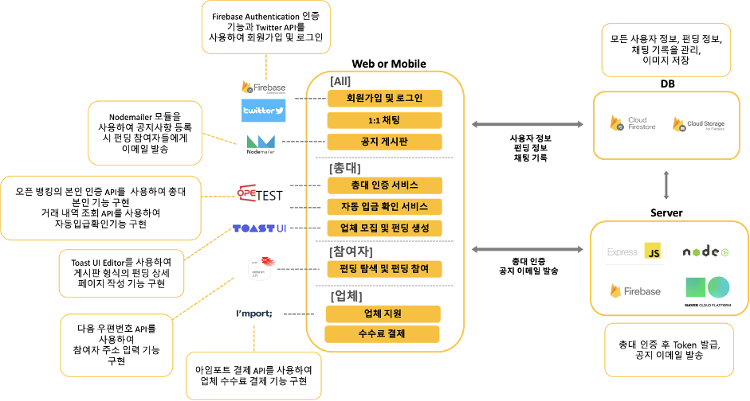
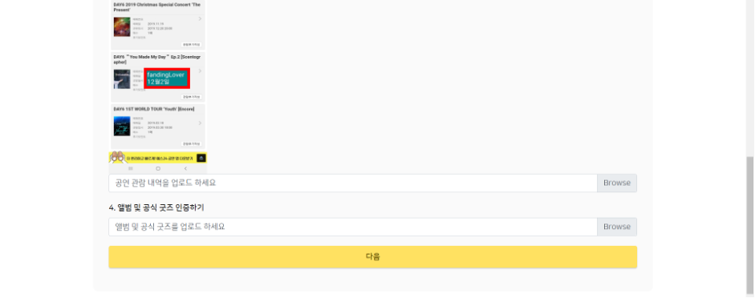
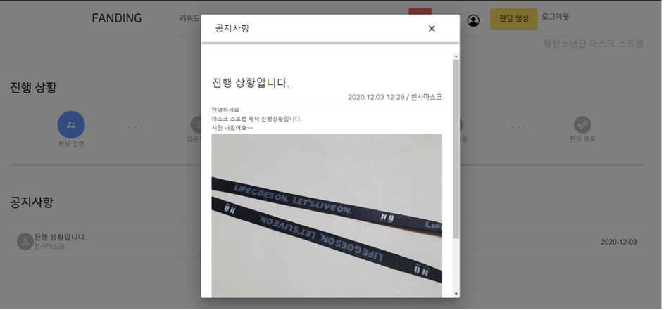

# FANDING 
[2020-2 아주대학교 SW 캡스톤디자인]
---------------------------------------
## About FANDING
- K-POP 팬을 위한 크라우드 펀딩 웹 애플리케이션 서비스
  Crowdfunding service for fans who like K-pop
  
  K-POP 시장이 성장하면서, K-POP 분야의 크라우드 펀딩이 SNS와 온라인 커뮤니티 중심으로 증가하고 있다. FANDING은 하나의 플랫폼 안에서 펀딩 기획부터 완료까지 한 번에 진행할 수 있는 서비스이다. 펀딩의 총책임자인 총대의 부담을 덜기 위해 업체를 모집하는 서비스와 자동 입금확인 서비스를 제공한다. 총대의 신뢰성을 보장하기 위해 본인인증을 도입하여 더욱 안전한 K-POP 크라우드 펀딩 생태계를 조성한다. SNS에 흩어진 정보를 하나로 모아줌으로써 참여자는 여러 펀딩을 비교해본 후 원하는 펀딩에 참여할 수 있다.
---------------------------------------
## Authors & Role (가나다 순)
- [정재욱](https://github.com/br12345678): Chatting, Payment
- [주재린](https://github.com/JaeLinJoo): Open banking API, UI design, Notice
- [최진영](https://github.com/jinyoung0612): Full Stack, Funding, Server 
- [한지은](https://github.com/Daily-Jin): Application UI & Frontend
---------------------------------------
## System Architecture
- 전체 시스템 구조도

- 컴포넌트 별 상세 구조

---------------------------------------
## Target Users

## Functions of FANDING
#### 1. 총대
- 로그인 및 회원가입 기능 (Twitter 로그인 포함)
- 펀딩 생성 기능
- 업체 모집 기능
- 펀딩 진행 기능
- 자동 입금 확인 기능 (오픈 뱅킹 API 이용) 
- 공지사항 작성 기능
- 1:1 채팅 기능

#### 2. 참여자
- 로그인 및 회원가입 기능 (Twitter 로그인 포함)
- 필터링 (최신순, 인기순)과 검색을 통한 펀딩 검색 기능 
- 펀딩 참여 기능
- 펀딩 진행 상황 및 공지사항 확인 기능
- 공지사항 업데이트 이메일 알림 기능 
- 1:1 채팅 기능

#### 3. 업체
- 로그인 및 회원가입 기능
- 필터링 (최신순, 인기순)과 검색을 통한 펀딩 검색 기능
- 업체 지원 기능
- 결제 기능
- 공지사항 작성 기능
- 1:1 채팅 기능
---------------------------------------

## Result
### All Users
- 로그인 및 회원가입 기능

- 메인페이지

- 펀딩 검색

- 펀딩 필터링

- 문의 채팅

- 채팅 알림

- 내 정보 수정

### 총대
- 총대 본인인증

- 업체모집

- 업체선정

- 팬인증

- 펀딩생성

- 펀딩관리

### 참여자
- 펀딩 상세페이지

- 펀딩 찜하기

- 펀딩 공유하기

- 펀딩 참여

- 펀딩 공지사항 확인 및 이메일 알림

- 펀딩 관리

- 펀딩 참여 현황 보기

- 펀딩 마감

- 펀딩 공지사항 및 제작상황 관리

### 업체
- 업체 지원

- 수수로 결제

### Fanding 관리자
- 업체 결제 여부 확인

---------------------------------------
## Framework & Language

- **Web**
  - Frontend: Reat, Reactstrap, BootStrap, Material-UI (HTML, CSS, javascript)
  - Backend: Node.js (Language: javacript)
  - DataBase: Firebase

- **사용하는 외부 API**
  - 오픈뱅킹 API
  - IamPort API
---------------------------------------
## Code
- public > index.html : SPA(Single Page Application), 화면이동에 필요한 html 코드
- src> components : 기능 구현을 위한 코드
- src > config : 구성을 위한 명세서 코드
- src > server : api를 Node.js로 처리하기 위한 proxy NodeJs server
- src > store : 상태 관리를 하는 장소 (redux)
- package.json : npm 패키지에 관한 정보와 의존중인 버전에 대한 관한 정보를 담은 코드
---------------------------------------
## Reference
- reactstrap      <https://reactstrap.github.io/> 
- material-ui    <https://material-ui.com/>  
- material-icons <https://material-ui.com/components/material-icons/>
- react-icons <https://react-icons.github.io/react-icons/> 
- lifecycle of react <https://reactjs.org/docs/state-and-lifecycle.html/>

## GIT 주소
- https://github.com/AJOU-A2B2/FANDING

